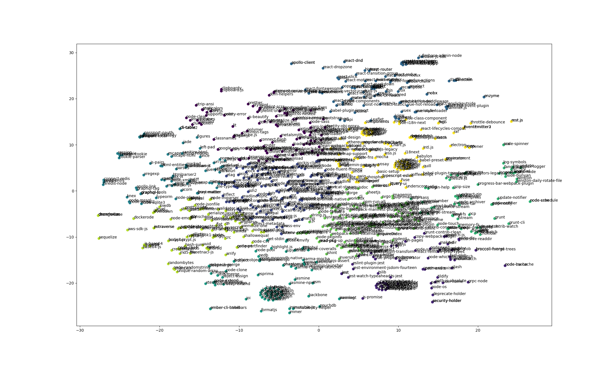

# NPMonitor - An embedding monitoring tool for npm packages

## Results

Plotted above are the final results visualized using matplotlib.  
The points represent NPM packages which are TSN-ed to 2D space to be more easily visualized for humans.  

The colors represent the K-Means clusters, which in retrospect, are not very useful.  

## methodology

Data is obtained from [anvakas npm ranking](https://gist.github.com/anvaka/8e8fa57c7ee1350e3491).  
Data is processed to get the github url for each package and then the github url is used to get the readme file.  
The readme file is then processed to become a text only string and fed into the embedding model. Currently, the model is an off the shelf docker service that runs [sentence-transformers MiniLM](https://huggingface.co/sentence-transformers/all-MiniLM-L12-v2). We get a 384 dimensional vector for each package, that should represent the packages readme file description in latent space.
Such latent space allows us to cluster the packages together and see if there are any interesting patterns and allows for simmilairity search.

Simmilairity search is done using a simple cosine similarity function and it performs catastrophically.
When changed to a euclidean distance function, it performs much better, but still not great.  

I believe that 1000 packages is not enough to get a good number of similar packages, and that the embedding model is not good enough to capture the meaning of the readme files.  
My future plans is to clean the readme files more, and to use a better embedding model.
